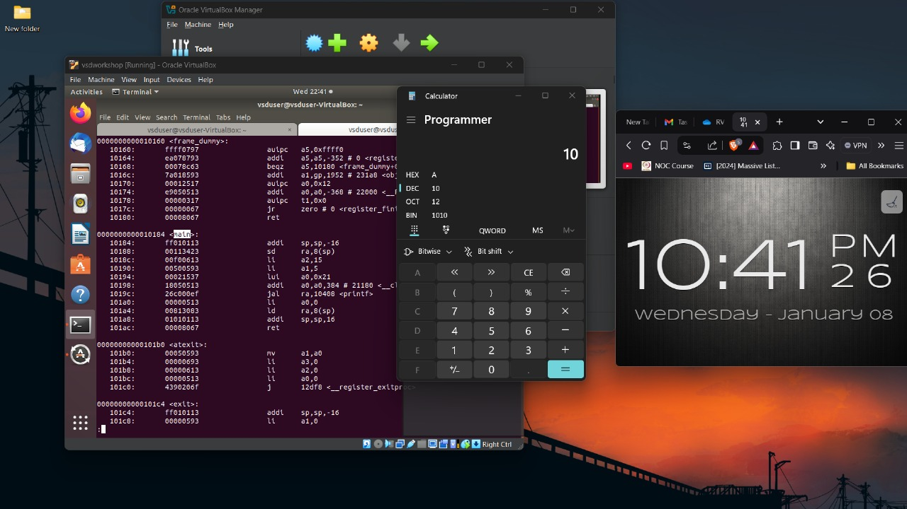
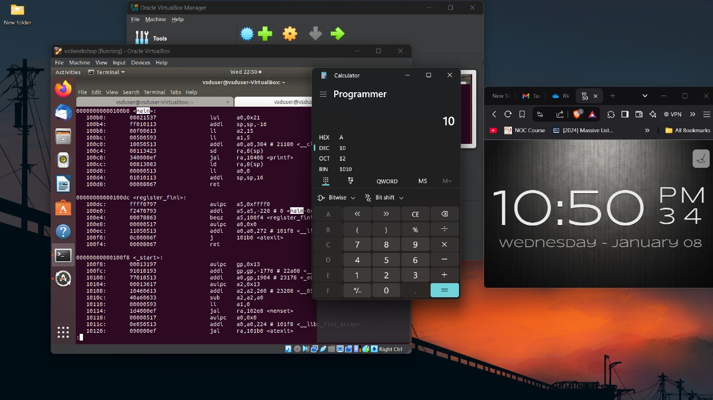

# RISC-V Internship program powered by SAMSUNG and VSD
### This RISC-V Internship using VSDSquadron Mini is based on RISC-V architecture and uses open-source tools to teach students about VLSI SoC Design and RISC-V. The instructor and guide for this internship is Kunal Ghosh Sir, Founder of VSD.

# Basic Details

### Name: NANDEESH C
### College: JSS SCIENCE AND TECHNOLOGY UNIVERSITY, MSYURU
### Email ID: cnandeesh.2003@gmail.com
### GitHub Profile: Cnandeesh03
### LinkedIN Profile: [Nandeesh C](www.linkedin.com/in/nandeesh-c)

# Task-1

 Task-1: C based lab screenshots 

 

 Task-1: RISC-V based lab screenshots 

 

# Task-2

 Task-2:  lab screenshots 

 

